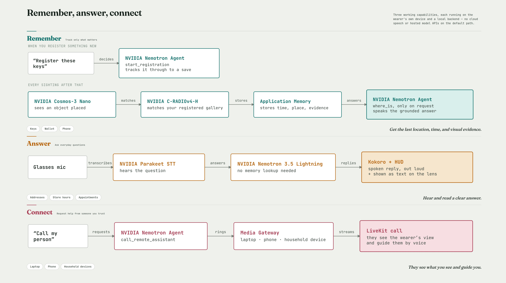
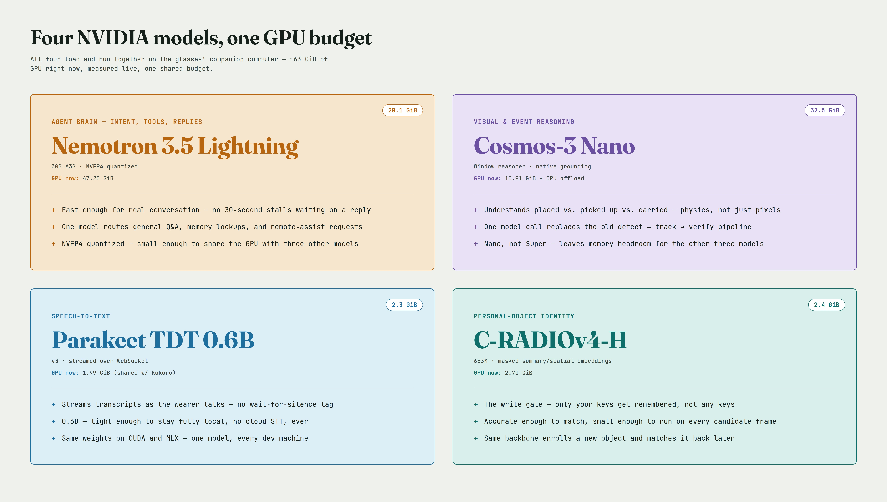
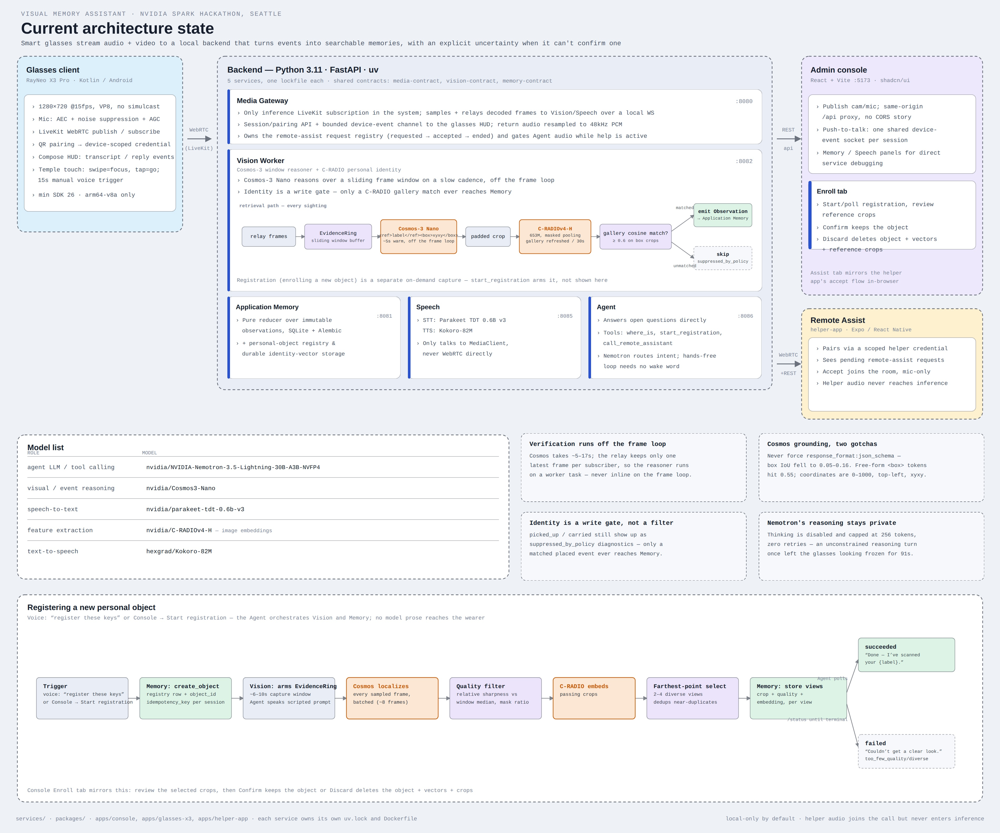

# Visual Memory Assistant

A local-first wearable assistant that remembers personal objects, answers everyday questions, and
connects a trusted person when human help is needed. RayNeo X3 Pro glasses stream first-person
camera and microphone media to the GN100, where perception, speech, reasoning, and memory run
locally by default.

> *“Where did I leave my keys?”*
>
> *“On the living-room coffee table at 10:42, based on the last confirmed placement. I have not
> confirmed a newer location.”*

That second sentence is the hard part. Being usefully uncertain matters more than sounding
confident.

Built for the NVIDIA Spark Hackathon, Seattle.

## Product at a glance

[](docs/assets/product-capabilities.jpg)

The three user-facing capabilities share one local backend: remember personal-object placements,
answer ordinary questions, and connect a trusted human helper. The diagram's voice-registration row
shows the intended end state. For the current demo, reliable enrollment is operator-guided in the
Console; automatic crop extraction and standalone smart-glasses registration are explicitly tracked
as backlog items B-002 and B-003.

## Three assistant experiences

### 1. Personal visual memory

For the current demo, an operator freezes the live glasses POV in the Console, draws tight crops
around a personal object from several angles, reviews them, and explicitly confirms registration.
Only then does the system store C-RADIO gallery views, resolve that stable identity in later video,
and record confirmed placements in structured Application Memory. Automatic extraction and a
wearer-only glasses registration UI are deferred, not silently substituted for this reliable path.

When the wearer asks where an object is, Nemotron calls `where_is(label)`. Application Memory—not
the language model—is authoritative about its current or historical location. Registered objects
and their stable state survive glasses reconnects and new sessions.

### 2. Local personal assistant

Every completed non-empty glasses transcript reaches local NVIDIA Nemotron, which owns intent and
tool selection. It can answer concise general questions directly while using bounded tools for
personal visual memory and registration. Private model reasoning is removed before HUD display or
speech playback, and voice generation is bounded to avoid long apparent stalls.

Hermes profiles, `SOUL.md`, personal text memory, and web search are future improvements tracked in
the [Product Backlog](docs/17-Product-Backlog.md); they are not part of the current runtime.

### 3. Remote human assistant

The wearer can say, “Call my remote assistant.” The Agent calls `call_remote_assistant()` with a
trusted, non-model-visible session identity. A paired helper phone receives the request and joins
the same LiveKit room to see the wearer's camera and speak with them.

After the request succeeds, the Agent allows one fixed acknowledgement and immediately closes its
session audio gate. While assistance is `requested` or `accepted`:

- no new wearer transcript is submitted to Nemotron;
- the Agent's STT socket is closed;
- queued transcripts and in-flight ordinary replies are suppressed; and
- helper media remains outside Vision, Speech, Agent, and Application Memory inference.

Listening resumes with a fresh STT subscription after the helper disconnects or an unanswered
request expires.

## NVIDIA stack

| Role | Technology |
|---|---|
| Agent reasoning and tool routing | NVIDIA Nemotron 3.5 Lightning 30B-A3B NVFP4 through local vLLM |
| Multimodal temporal reasoning | NVIDIA Cosmos 3 Nano |
| Personal-object embeddings | NVIDIA C-RADIOv4-H 653M |
| Speech recognition | NVIDIA Parakeet TDT 0.6B v3 |
| Text-to-speech | Kokoro 82M |
| Glasses media | RayNeo X3 Pro + LiveKit/WebRTC |
| Trusted object state | FastAPI Application Memory with structured observations and evidence |
| Target deployment | Linux ARM64/CUDA on the Acer GN100 |

[](docs/assets/nvidia-models-one-gpu.jpg)

The displayed allocations were measured from the integrated GN100 run. Nemotron and Cosmos use
separate local vLLM endpoints; Cosmos uses CPU offload, and the Speech process shares its allocation
between Parakeet and Kokoro. The checkpoint-size badges and live process allocations are different
measurements.

## Runtime architecture

```text
RayNeo X3 Pro glasses
  ├─ camera ──────> Media Gateway ─> Cosmos + C-RADIO ─> Application Memory
  ├─ microphone ──> Media Gateway ─> Parakeet ─> Nemotron ─> bounded tools
  │                                                        └─> Kokoro ─> glasses
  └─ assist request ────────────────────────────────> paired helper app
                                                        └─ LiveKit human call
```

The language model may decide whether to call a tool, but it cannot create a session identity,
overwrite visual memory, or turn a weak perception into trusted object state. Structured reducers
and deterministic guards decide what the system is allowed to claim.

[](docs/assets/current-architecture.jpg)

**Enrollment update:** the service topology and runtime recognition path above remain current, but
the registration strip in this architecture snapshot predates the operator-guided Console flow.
Today, Console crops stay browser-local until explicit confirmation; Cosmos does not choose or veto
those crops. The experimental automatic API remains available for evaluation only.

## Quick start

Prerequisites are Git, Python 3.11, [uv](https://docs.astral.sh/uv/), Node.js 20.19+ with npm,
Docker, and curl. Then run the CPU-safe profile:

```bash
git clone https://github.com/NadChern/nvidia_hack_seattle.git
cd nvidia_hack_seattle

VMA_AGENT_BACKEND=stub \
VMA_REASON_KIND=fixture \
VMA_IDENTITY_KIND=fixture \
VMA_TTS_BACKEND=stub \
./scripts/dev_stack.sh --fixture
```

The launcher installs locked dependencies, creates local LiveKit credentials when needed, starts
the five Python services plus LiveKit and the Console, waits for readiness, and writes logs under
`logs/`. Open **http://127.0.0.1:5173**, choose **Glasses → Publish**, and use the development
machine as virtual glasses. Stop everything with Ctrl-C.

This fixture profile reproduces media, APIs, UI, contracts, and failure handling without claiming
that real perception or speech models are running. Model selection is platform-aware and never
silently chooses a hosted provider.

**New to the project? Open [`docs/onboarding.html`](docs/onboarding.html) in a browser.** Working
with a coding agent? Start with [`docs/13-Dev-Onboarding.md`](docs/13-Dev-Onboarding.md) and
[`AGENTS.md`](AGENTS.md). Detailed macOS, Windows/WSL, and GN100 notes live in
[Dev Onboarding](docs/13-Dev-Onboarding.md).

### Physical glasses

The pure-Kotlin client is under `apps/glasses-x3`. Pair it with the target Gateway, then it publishes
camera/microphone media, renders transcripts and replies on the HUD, and plays the Gateway's return
audio track. See the [Glasses Client Plan](docs/15-Glasses-Client-Plan.md) and
[Development and Deployment](docs/08-Development-and-Deployment.md).

### Remote helper app

The Expo/React Native helper is under `apps/helper-app`:

```bash
cd apps/helper-app
npm ci
npm start
```

It pairs through the Gateway's existing QR flow, receives pending requests over WebSocket, and
joins an accepted session as the helper participant. A development build is required for the
native LiveKit integration.

## Reproduce the physical demo

### Configuration and credentials

The default demo is local: it does **not** require an NVIDIA hosted-inference key, OpenAI key, or
another cloud model API key. LiveKit runs locally, and Nemotron, Cosmos, C-RADIO, Parakeet, and
Kokoro run on the trusted GN100. A Hugging Face token is needed only if a model publisher requires
authentication while populating the approved local cache.

Start from the documented sample:

```bash
cp .env.example .env
# Replace every deployment placeholder; never commit .env.
${EDITOR:-vi} .env
set -a
. ./.env
set +a
```

The sample defaults to loopback and fixture models. A physical trusted-LAN run must replace or
remove those fixture settings and configure the local model endpoints. Important variables are:

| Variable | Purpose |
|---|---|
| `VMA_BIND_ADDR` | Exact trusted-LAN address used by glasses and operator devices |
| `VMA_LIVEKIT_API_KEY` / `VMA_LIVEKIT_API_SECRET` | Local LiveKit service credentials |
| `VMA_INTERNAL_API_TOKEN` | Protects trusted backend and Console proxy APIs |
| `VMA_DEVICE_ID_ALLOWLIST` | Comma-separated approved glasses device identifiers |
| `VMA_LIVEKIT_PUBLIC_URL` | LiveKit URL reachable from the RayNeo glasses |
| `VMA_LLM_BASE_URL` / `VMA_LLM_MODEL` | Local Nemotron vLLM endpoint and pinned model name |
| `VMA_REASON_BASE_URL` / `VMA_REASON_MODEL` | Local Cosmos vLLM endpoint and pinned model name |
| `VMA_IDENTITY_KIND=radio` | Enables the pinned C-RADIOv4-H adapter |
| `VMA_DETECTION_LABELS` | Canonical labels offered by registration and Vision |
| `VITE_VMA_INTERNAL_API_TOKEN` | Console build-time API token; `dev_stack.sh` inherits the internal token automatically |

Generate deployment secrets instead of reusing the development examples:

```bash
export VMA_LIVEKIT_API_SECRET="$(openssl rand -hex 24)"
export VMA_INTERNAL_API_TOKEN="$(openssl rand -hex 32)"
```

External LLM testing is a separate opt-in profile requiring both
`VMA_ALLOW_EXTERNAL_LLM=true` and `VMA_LLM_API_KEY`. It is not the default demo path. See
[Agent Laptop Testing](docs/14-Agent-Laptop-Testing.md).

### Start and verify

Start the pinned local Nemotron and Cosmos endpoints and ensure model caches are populated before
bringing up the application stack. Then:

```bash
./scripts/dev_stack.sh --allow-lan
```

All six application endpoints should become ready:

```bash
for url in \
  http://${VMA_BIND_ADDR}:8080/health/ready \
  http://${VMA_BIND_ADDR}:8081/health/ready \
  http://${VMA_BIND_ADDR}:8082/health/ready \
  http://${VMA_BIND_ADDR}:8085/health/ready \
  http://${VMA_BIND_ADDR}:8086/health/ready \
  http://${VMA_BIND_ADDR}:5173/; do
  curl -fsS "$url" >/dev/null && echo "ready  $url"
done
```

Pair the X3 Pro with the Gateway QR flow, publish its camera and microphone, and open the Console at
`http://${VMA_BIND_ADDR}:5173`.

### Demo sequence

1. In **Enroll**, choose `keys`, freeze the live POV, draw a tight crop, and add several distinct
   angles. Enlarge every pending view and choose **Confirm and register**.
2. Place the registered keys on a recognizable surface and wait for a complete Cosmos window.
3. In **Vision**, show the receipt chain: `placed → personal identity → memory written`.
4. Turn away and ask, “Where are my keys?” Parakeet transcribes, Nemotron calls `where_is`,
   Application Memory supplies the evidence, and Kokoro speaks the grounded answer.
5. Ask, “Call my remote assistant.” Show the fixed request acknowledgement, helper acceptance,
   shared wearer POV, inference-audio suppression during the call, and listening resumption after
   disconnect.

The projected Console is the proof surface. Vision is a sparse Cosmos window-event pipeline, so do
not describe it as continuous object tracking, live motion state, or live bounding boxes.

## Data, fixtures, and provenance

No external dataset was used to train this repository, and no wearer media is committed. The
runtime uses publisher-provided pretrained checkpoints recorded in each service's
`model-manifest.toml`.

Evaluation and automated tests use:

- byte-exact synthetic audio/video relay fixtures in `packages/media-contract/fixtures`, generated
  by `packages/media-contract/scripts/build_fixtures.py`;
- programmatic synthetic images, embeddings, events, observations, and reducer histories created
  inside service and shared-contract tests;
- developer-captured photos of three physical keyrings for the C-RADIO identity probe, documented
  in `docs/spikes/identity-probe/RESULTS.md`; these consented local files are gitignored under
  `clips/identity-probe` and are not redistributed; and
- live RayNeo X3 Pro/GN100 physical runs used as release evidence, with raw media excluded from Git
  and logs.

Synthetic fixtures establish deterministic contract behavior; they are not presented as a
real-world accuracy benchmark. Automatic enrollment extraction needs a reviewed evaluation set and
is tracked as backlog B-002.

## What exists today

| Component | State |
|---|---|
| **Glasses app** (`apps/glasses-x3`) | Working RayNeo client for pairing, camera/microphone publishing, HUD events, and return audio. |
| **Helper app** (`apps/helper-app`) | Working paired mobile client for incoming assist requests and LiveKit human calls. |
| **Console** (`apps/console`) | Working virtual glasses, live video, memory review/reset, enrollment, speech, Agent, and Assist UI. |
| **Media Gateway** (`services/media-gateway`) | Working LiveKit session authority, bounded media relay, return audio, HUD events, and remote-assist lifecycle. |
| **Media contract** (`packages/media-contract`) | Working relay models, client, framing, and provider/consumer fixtures. |
| **Vision** (`services/vision-worker`) | Working Cosmos window reasoner, C-RADIO identity gallery, operator-confirmed crop enrollment, experimental automatic capture API, and placed-event promotion. |
| **Application Memory** (`services/application-memory`) | Working durable object registry, evidence/state reducer, cross-session lookup, and honest location answers. |
| **Speech** (`services/speech`) | Working Parakeet STT and Kokoro TTS with real CUDA backends on the GN100 and explicit stubs elsewhere. |
| **Agent** (`services/agent`) | Working local Nemotron/Google ADK orchestration with `where_is`, `start_registration`, and `call_remote_assistant`. |

## Repository layout

```text
apps/
  glasses-x3/       pure-Kotlin RayNeo application
  helper-app/       Expo/React Native remote-helper application
  console/          browser development and operator console
services/           five independently locked FastAPI services
packages/           shared contracts and bounded clients
tools/dev-livekit/  local LiveKit configuration and tooling
docs/               architecture, contracts, privacy, plans, and onboarding
deploy/             release configuration
compose.dev.yaml    local development dependencies
compose.yaml        GN100 release topology
compose.gpu.yaml    real-model GPU overlay
```

## Privacy and safety boundaries

Raw media, transcripts, inference, object memory, and evidence remain on the glasses and trusted
workstation by default. Enabling an external model or search provider is explicit opt-in and must
be disclosed. Remote-assist mode intentionally shares the live room with a paired helper device.

The helper app never enables its camera, and helper tracks are excluded from inference ingest.
However, the tested LiveKit server rejected a server-enforced microphone-only source grant, so the
current helper token temporarily permits any publish source. Client-side camera disabling is not a
security boundary; the strict expected-failure test tracks restoration of server enforcement.

The MVP is a memory aid, not a guarantee of an object's current location and not a safety-critical
medication-management system. It distinguishes current confirmation, historical placement,
ambiguity, and unknown state. See [Privacy and Security](docs/07-Privacy-and-Security.md).

## Known limitations and next steps

- **Enrollment is operator-guided in the Console.** Automatic crop extraction produced unreliable
  boxes in cluttered scenes, so it is not the demo default. A measured automatic pipeline is backlog
  B-002; equivalent manual registration directly from the smart-glasses app is B-003.
- **Vision is event-window based, not continuous tracking.** Cosmos evaluates sparse windows. Only
  confirmed `placed` events are authoritative; `picked_up` and `carried` remain diagnostic because
  sparse motion labels can invalidate a good location incorrectly.
- **No barge-in.** Return-audio timing suppresses echo recursion, and the wearer must wait until the
  current answer finishes before starting another turn.
- **Object identity is bounded by the enrolled gallery.** C-RADIO can abstain or confuse visually
  similar instances; no identity match means no Memory write.
- **Location answers are evidence-bounded.** The system reports confirmed, historical, ambiguous,
  or unknown state rather than guaranteeing that an object has not moved outside a captured event.
- **Remote Assist still has a server-enforcement debt.** The helper camera is disabled client-side,
  but the current LiveKit grant cannot yet enforce microphone-only publishing; an expected-failure
  test tracks this.
- **Physical deployment is platform-specific.** The complete model set depends on pre-populated
  caches, two local vLLM endpoints, Linux ARM64/CUDA compatibility, trusted-LAN networking, and
  physical X3/GN100 verification.
- **Hermes profiles, personal text memory, and web search are deferred.** They remain isolated from
  authoritative visual object state in backlog B-001.

See the [Product Backlog](docs/17-Product-Backlog.md) for trust boundaries and acceptance criteria,
and [Evaluation Plan](docs/04-Evaluation-Plan.md) for the remaining measurement gates.

## Documentation

Start with [Overview](docs/00-Overview.md), which indexes the complete documentation set.

- [Recommended Architecture](docs/01-Recommended-Architecture.md)
- [Data Contract and Memory Semantics](docs/06-Data-Contract.md)
- [Privacy and Security](docs/07-Privacy-and-Security.md)
- [Development and Deployment](docs/08-Development-and-Deployment.md)
- [Media Relay Contract](docs/12-Media-Relay-Contract.md)
- [Dev Onboarding](docs/13-Dev-Onboarding.md)
- [Glasses Client Plan](docs/15-Glasses-Client-Plan.md)
- [Main Integration and Remote Assist Plan](docs/16-Main-Integration-and-Remote-Assist-Plan.md)
- [Product Backlog](docs/17-Product-Backlog.md)

## Engineering rules

- Python services use CPython 3.11, uv, FastAPI, Pydantic v2, Ruff, Pyright, and pytest.
- Every deployable service owns its `pyproject.toml`, `uv.lock`, tests, health endpoints, and
  Dockerfile.
- No secrets, raw media, transcripts, or tokens belong in source or logs.
- External model endpoints are rejected unless explicitly enabled.
- Physical GN100 and glasses testing is the final release gate.

```bash
python3 .agents/skills/visual-memory-repo-standards/scripts/validate_repo.py
```

## Event

[NVIDIA Spark Hack: Seattle](https://luma.com/spark-hack-seattle?tk=8XBLkn) ·
[DGX Spark](https://build.nvidia.com/spark?utm_source=luma) ·
[NVIDIA Build models](https://build.nvidia.com/models?utm_source=luma) ·
[VSS Spark Playbook](https://build.nvidia.com/spark/vss?utm_source=luma)

## Participants

- [Erin Shih](https://github.com/erinshih413) — `erinshih413`
- [Jacky Huang](https://github.com/jack980180) — `jack980180`
- [Nadine Chernova](https://github.com/NadChern) — `NadChern`
- [Aleexander Kuznetsov](https://github.com/AlexSKuznetsov) — `AlexSKuznetsov`
