# Architecture Diagram

This diagram is the visual companion to [Recommended Architecture](01-Recommended-Architecture.md). It shows logical boundaries; components may share a container when the documented deployment policy permits it.

```mermaid
flowchart LR
    subgraph glassesDevice ["Smart glasses"]
        glassesClient["Pure-Kotlin client<br/>Compose + LiveKit Android SDK"]
    end

    subgraph trustedWorkstation ["Acer GN100 trusted local workstation"]
        subgraph mediaPlane ["Media plane"]
            livekit["Self-hosted LiveKit"]
            mediaWorker["Media Gateway worker"]
            speechService["Speech Service"]
        end

        subgraph visionPlane ["Vision plane"]
            perception["Perception and event pipeline"]
            verifier["Spatial and event verifier"]
            spatialWorker["Experimental spatial worker"]
        end

        subgraph applicationPlane ["Application and memory plane"]
            agentService["Agent and Query Service"]
            memoryService["Memory Service"]
        end
    end

    subgraph controlledStorage ["Controlled local storage"]
        database[("Relational database")]
        evidenceStore[("Evidence frames and clips")]
        modelCache[("Pinned model cache")]
    end

    glassesClient <-->|"Encrypted WebRTC"| livekit
    glassesClient <-->|"Pairing, session, HUD events"| mediaWorker
    livekit <-->|"Tracks and return audio"| mediaWorker
    mediaWorker <-->|"Audio and synthesized audio"| speechService
    speechService <-->|"Transcript and answer audio"| agentService
    agentService -->|"Transcript and guarded reply events"| mediaWorker

    mediaWorker -->|"Sampled video"| perception
    perception -->|"Candidate window and metadata"| verifier
    perception -->|"Store bounded evidence"| evidenceStore
    verifier -->|"Retrieve evidence window"| evidenceStore
    verifier -->|"Confirmed observation"| memoryService
    verifier -->|"Rejected or unverified diagnostic"| database

    agentService <-->|"Query and grounded result"| memoryService
    memoryService -->|"State and history"| database
    memoryService -->|"Evidence access"| evidenceStore

    speechService -->|"Pinned STT and TTS"| modelCache
    perception -->|"Pinned detection and geometry"| modelCache
    verifier -->|"Pinned VLM"| modelCache

    perception -.->|"Selected keyframes"| spatialWorker
    spatialWorker -.->|"Pose, map, or BEV evidence"| verifier

    classDef clientNode fill:#dbeafe,stroke:#2563eb,color:#172554
    classDef gatewayNode fill:#e0f2fe,stroke:#0284c7,color:#0c4a6e
    classDef serviceNode fill:#dcfce7,stroke:#16a34a,color:#14532d
    classDef dataNode fill:#fef3c7,stroke:#d97706,color:#78350f
    classDef experimentNode fill:#f3e8ff,stroke:#9333ea,color:#581c87,stroke-dasharray:5 5

    class glassesClient clientNode
    class livekit,mediaWorker gatewayNode
    class speechService,perception,verifier,agentService,memoryService serviceNode
    class database,evidenceStore,modelCache dataNode
    class spatialWorker experimentNode
```

## How to read it

- Solid paths are the MVP runtime. The dotted spatial path is experimental and cannot block the critical path.
- The production client is the pure-Kotlin `apps/glasses-x3` app with pinned Gradle and LiveKit Android SDK dependencies. Actual-glasses and GN100 integration remain release gates.
- The Perception pipeline uses SAM, hand/object tracking, and the temporal state machine to propose a candidate; it does not write trusted memory.
- The verifier retrieves a bounded evidence window and returns `confirmed`, `rejected`, or `unverified`. Only a confirmed, schema-valid observation proceeds to the Memory Service.
- The Memory Service and relational database determine what the assistant may claim. The Agent only queries and verbalizes that state.
- GPT4Scene-style markers are an optional verifier input. LingBot-Map or Stream3D-VLM may occupy the experimental spatial-worker role only after their spikes pass.
- NVIDIA VSS contributes architecture patterns—stage separation, evidence retrieval, verification outcomes, bounded tools, and observability—but no VSS runtime component appears in the diagram.
- The default architecture has no cloud dependency. Fish Audio and any hosted signaling, TURN, telemetry, or model API remain explicit opt-in alternatives outside this local trust boundary.

## Deployment mapping

| Diagram boundary | MVP deployment |
|---|---|
| Pure-Kotlin Compose client with LiveKit Android SDK | Smart glasses |
| LiveKit, Media Gateway worker, Speech, Vision, Agent, and Memory | Docker Compose services on the Acer GN100 |
| Relational database, evidence, and model cache | Controlled GN100 volumes |
| Developer model adapters | Native MLX on compatible Macs, native PyTorch/CUDA on compatible Windows machines, or an explicit remote GN100 profile |

The diagram intentionally omits DeepStream, NVIDIA NIM, VIOS, Kafka, Redis, Elasticsearch, Kubernetes, and the VSS Agent because they are not MVP dependencies.
